# Roll the Wise Dice

 Roll the Wise Dice is an online game designed for all age groups, adults and children. The game is between you (the player) and the computer. The player can add their name.
- To start the game, you must click the "Start the Game" button.
- Enter your name to access the game! 
- After that let's play!
- Click on the "Roll the Dice" Button!
If the number on the player's dice is greater than the number on the computer's dice, congratulations, you are the winner. One point will be added to the score for you (the player).
If the number on the player's dice is lower than the number on the computer's dice, you have lost, try again. One point will be added to the score for the computer.
If the numbers on both dice are the same, it is a draw. The score does not change.
The game can last for 7 dice rolls.
- After 7 rollings the winner of the game will be shown!
- A "New Game" button will start a new game.

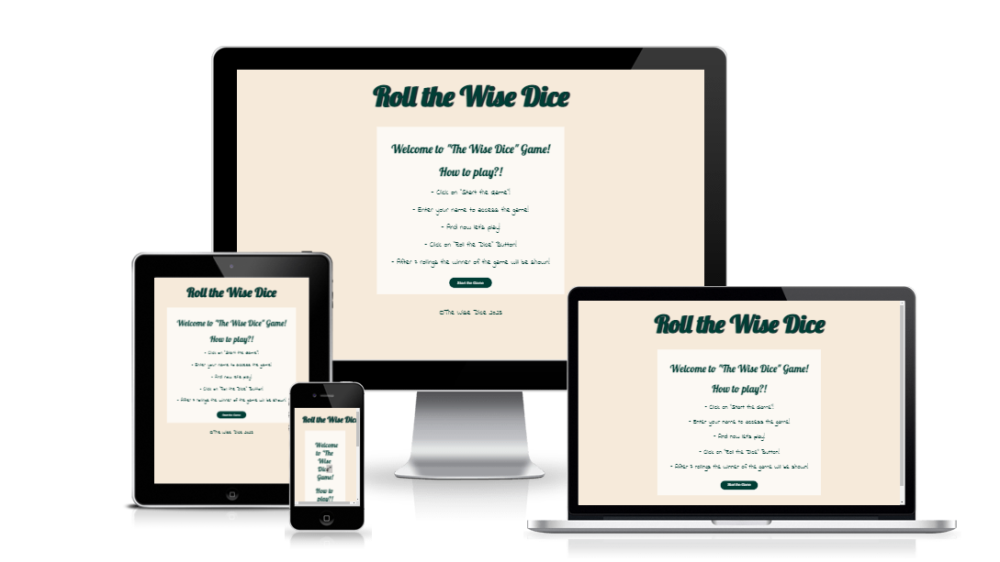

## Contents

* [Features](#features)
  * [Header](#header)
  * [Landing section](#landing-section)
  * [Username section](#username-section)
  * [The Game Area](#game-area)
  * [The Game Results](#game-results)
  * [Start new game](#new-game)
  * [The Footer](#footer)
* [Wireframes](#wireframes)
* [Design](#design)
  * [Colours](#colours)
  * [Typography](#typography)
* [Testing](#testing)
  * [Manual Testing](#manual-testing)
  * [Validation](#validation)
* [Deployment](#deployment)
  * [Development process](#development-process)
* [Credits](#credits)
* [Acknowledgments](#acknowledgments)

## FEATURES  

### Header 

- The header shows the game name: The Wise Dice. It is at the top of the page and clearly contrasts with the background.

### Landing section
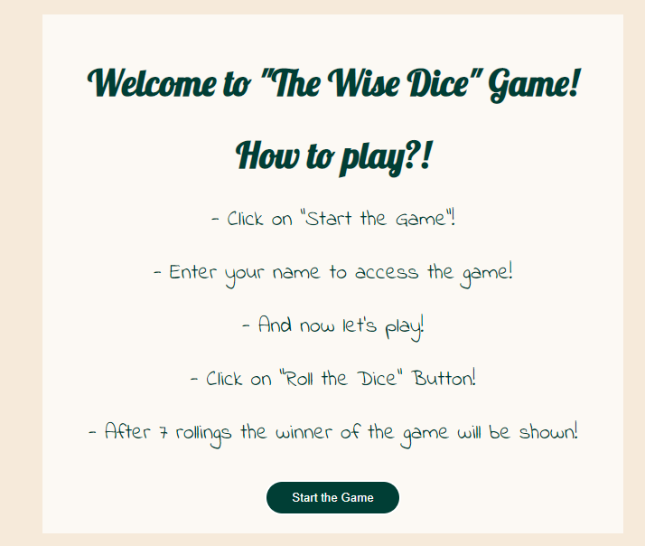
- The landing page shows the info and the rules for the game: The Wise Dice. At the bottom of landing-section is "Start the Game" button.

### Username section
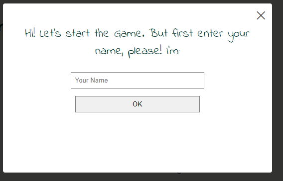
- The landing section is a popup that requires the name of the player. If the the name accomplish all the user criteria the "Let's play button shows."
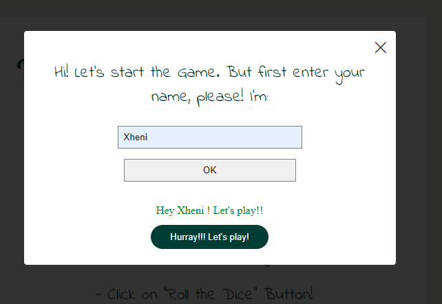

### The Game Area

- At the game area there are clear instructon to start and play the game. The player is against the Computer. To start the game all you need to do is to click the button "Roll". After that a message will appear at the "Game Result" if you won/lost/draw. 

- This section provides two images of dices and a button that the user can click to start and play the game. 

### The Game Results

- When the user clicks the "Roll" button, the images of the dices shown a random dice number on the game board. 
- If the number on the player's dice is greater than the number on the computer's dice, congratulations, you are the winner. 
- One point will be added to the score for you (the player).
- If the number on the player's dice is lower than the number on the computer's dice, you have lost, try again. 
- One point will be added to the score for the computer.
- If the numbers on both dice are the same, it is a draw. - - The score does not change.
- The game will end after the 7th roll of dices. 
- An alert mesage will apear on the screen if you won the game or not.
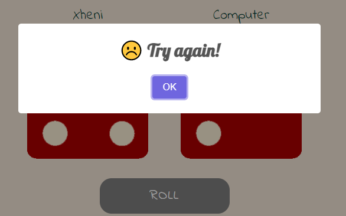
- Roll Button is disabled and the color changes to grey.

### Start New Game
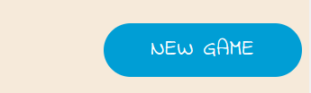
- If you want to start a new game, click the "New Game" button. 

### The Footer

- The footer section shows the creator of the game.

## Wireframes  

Wireframes were created for desktop version of the game with the Program [Balsamiq](https://balsamiq.com/).

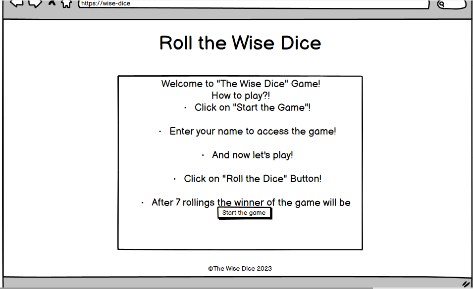
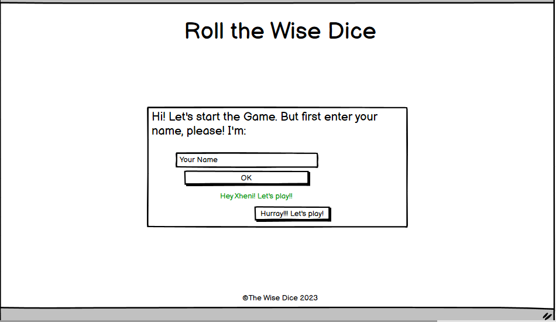
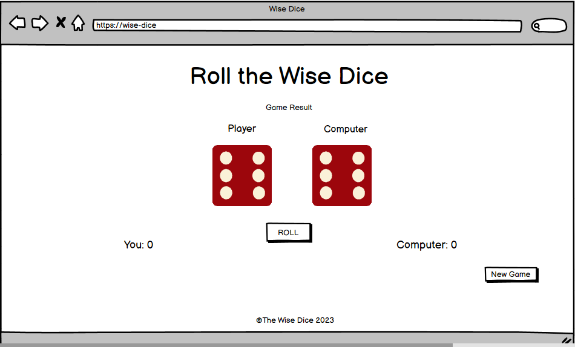

## Design  

### Colours  

- The game uses a palette of Natural Palette.
- The Tropical Rain Forest is used for heading, pharagraphs and the background-color of the button.
- Parchment is used for the backgroung-color of the body.

### Typography  
- For the heading is used the font Lobster
- For the pharagraphs and button, is used the font Indie Flower.

## Testing   

### Manual Testing  
- I tested playing this game in different browsers: Chrome, Firefox, Edge and Safari.
- I confirmed that the game results are alwasy correct
- I confirmed that the header, instructions, results and footer text are all readable and easy to understand.
- I confirmed that the colors and fonts chosen are easy to read and accessible by running it through lighthouse in devtools.
#### Lighthouse  
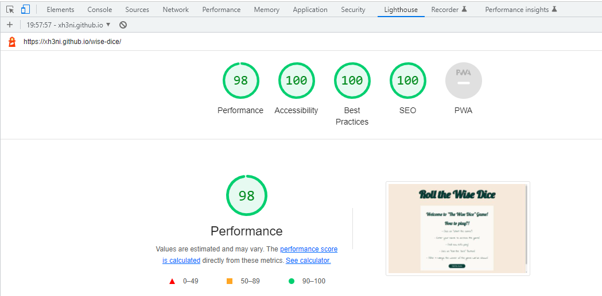

### Validatior Testing 
#### HTML  
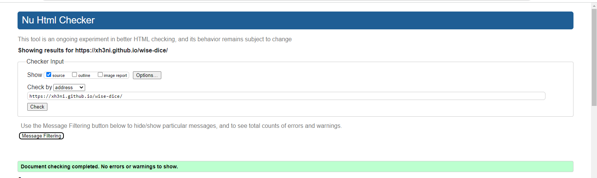     
There were no errors found on any page using the Nu HTML Checker. I used Nu HTML Checker because W3C HTML Validator there was an error from the page, Error 503.

#### CSS  
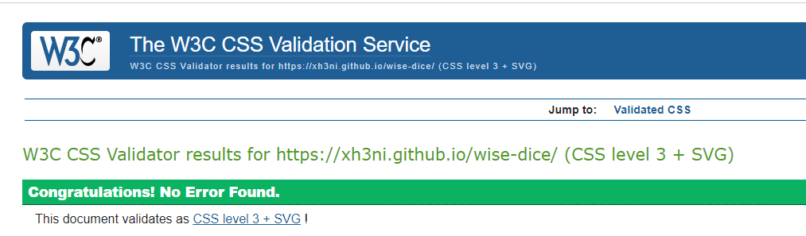  
There were no errors found in the stylesheet using the W3C CSS Validator.
#### JavaScript
  
There were no errors found in the script using the JS Hint Validator. 

## Deployment  

The site was deployed using GitHub pages. 

The steps to activate Github pages are as follows:
- Navigate to the settings tab in the GitHub repository.
- In the settings, navigate to the 'Pages' tab on the left of the page.
- In the 'Build and deployment' section, select 'Deploy from a branch' in the source dropdown.
- Select branch 'main' and click on 'Save'.

The live link can be found here: [Wise Dice](https://xh3ni.github.io/wise-dice/)

### Development process

- I started the program and repository using the Code Institute gitpod-full-template.
- Then I regularly staged my changes using the command `git add .` and then committed the staged changes to my local repository using `git commit -m 'short descriptive message here'`. 
- Finally, I would push the commits from my local repository up to the Github repository using the command `git push`.
- With every push, Github automatically deploys my latest commit from the 'main' branch to the Github pages.

## Credits  

- The dice-images are taken from google, random dice images

- The fonts are imported from [Google Fonts](https://fonts.google.com/).

- The Party Popper emoji is taken from [Emojipedia](https://emojipedia.org/party-popper/)
- The Frowning Face emoji is taken from [Emojipedia](https://emojipedia.org/frowning-face/)
- I have used the Swal library for javascript Alert.(https://sweetalert2.github.io/#download) I add the script at index.html page.

## Acknowledgments

I would like to acknowledge the following people who have helped me along the way in completing my first milestone project:
- My mentor, Jubril Akolade, for his advices and encouragement.